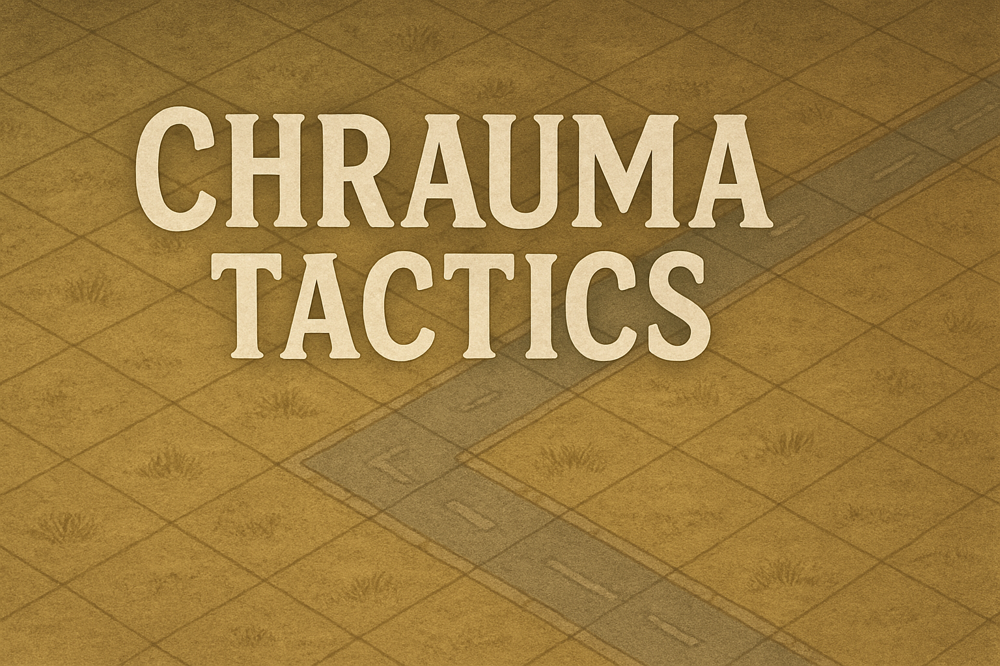

# Chrauma Tactics

**Chrauma Tactics** is a turn-based strategy game with auto-battler mechanics, built in Unity. Players deploy units in the planning phase, then watch them fight it out automatically in tactical, grid-based combat. With randomized elements, deep unit synergies, and evolving upgrades, no two games play the same.

## 🕹️ Game Overview

- **Genre**: Turn-Based Strategy / Auto-Battler  
- **Perspective**: Top-down  
- **Platform**: PC (planned: mobile/VR)  
- **Target Audience**: Tactics & strategy enthusiasts  

### 🔁 Core Gameplay Loop

1. **Planning Phase**: Draft a commander and deploy units on a grid  
2. **Combat Phase**: Units battle automatically based on AI logic  
3. **Post-Round**: Earn rewards, apply upgrades, and prepare for the next round  

## ⚔️ Key Features

- **Smart Deployment**: Positioning and composition are crucial  
- **AI-Driven Combat**: No mid-fight input — strategy happens beforehand  
- **Replayability**: Randomized commanders, upgrades, and units  
- **Progression**: Strengthen your army over multiple rounds  

## 🧠 Systems Overview

- **Commanders**: Randomly generated with unique stat boosts and one-time skills  
- **Units**: Each has stats, types, behavior rules, and potential abilities  
- **Upgrades**: Enhance unit stats or unlock powerful synergies  
- **Grid-Based Map**: Snap-to placement system with various tile types  

## 🛠️ Tech Stack

- **Engine**: Unity  
- **Data**: ScriptableObjects and/or JSON  
- **AI**: Rule-based targeting system  
- **Save System**: Mid-run persistence (units, upgrades, resources)  

## 🎯 Stretch Goals

- PvP Multiplayer  
- Weekly events & leaderboards  
- Environmental hazards  
- Advanced commander skill systems  

---

*This is a work-in-progress prototype. Expect regular changes as features are designed, tested, and iterated on.*

